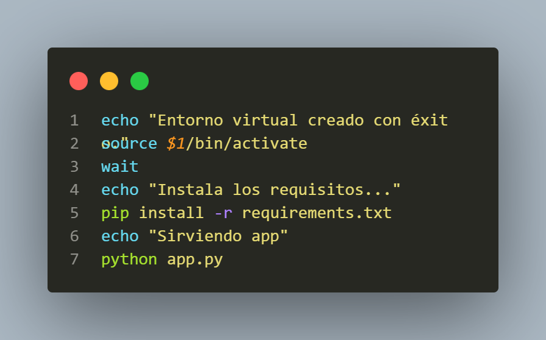

# NTP RESTful

```console
source build.sh <nombre del entorno>
```

Esto creará un entorno virtual con el nombre que se le pase como argumento y lo activará.

Además está preparado para instalar los requisitos y levantar el servidor.


